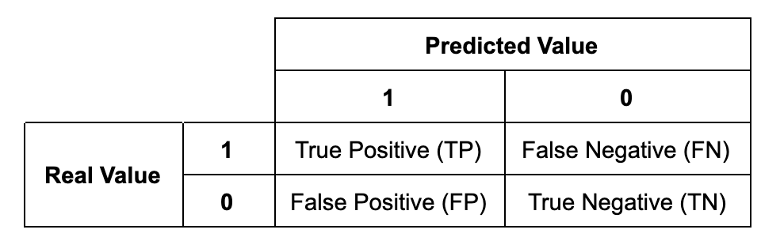

The Receiver Operating Characteristic (ROC) Curve is a way of measuring the performance of the model. The common practice is to look at the Area under the curve (AUC). For logistic regression, the curve can be constructed by changing the threshold of the predicted probability for classification. The ROC curve measures the performance of each threshold. The x-axis of the curve is the false positive rate (FPR, or fall-out) and the y-axis is the true positive rate (TPR, or recall). **The intuition is that for every 1 unit increase of false positive rate, how much true positive rate do we gain? As we decrease the threshold, trying to increase the true positive (TP) count, the false positive (FP) count also increases at the same time.**

The slope of a point on the ROC curve
$$=\frac{TPR}{FPR} = \frac{\frac{TP}{P}}{\frac{FP}{N}}$$

For a model that has no predicting power (no better than random), the slope of the ROC curve would be 45 degree (slope = 1):

$$
\begin{aligned}
\frac{TPR}{FPR} &= \frac{TP}{P} \cdot \frac{N}{FP} \\
&= \frac{TP}{FP} \cdot \frac{N}{P} \\
& =1
\end{aligned}
$$

since that if the model is random, then the ratio of $\frac{TP}{FP}$ would be the same as $\frac{P}{N}$

Use true value as the denominator, where $D$ is true default and $\mathcal{P}(D)$ is the probability of default, $ND$ is true non-default, $E$ is the predicted default and $NE$ is the predicted non-default.

* **True Positive Rate (TPR)**, sensitivity, recall, or hit rate:  
  $\frac{TP}{P} = \frac{TP}{TP+FN} = \mathcal{P}(E|D)$
* **False Positive Rate (FPR)**, or fall-out:  
  $\frac{FP}{N} = \frac{FP}{FP+TN} = \mathcal{P}(E|ND)$
* **True Negative Rate (TNR)**, specificity, or selectivity:  
  $\frac{TN}{N} = \frac{TN}{TN+FP} = \mathcal{P}(NE|ND)$
* **False Negative Rate (FNR)**, or miss rate:  
  $\frac{FN}{P} = \frac{FN}{TP+FN} = \mathcal{P}(NE|D)$

Use predictive value as the denominator:

* **Positive Predictive Value (PPV)**, or precision:  
  $\frac{TP}{TP+FP} = \mathcal{P}(D|E)$
* **Negative Predictive Value (NPV)**:  
  $\frac{TN}{TN+FN} = \mathcal{P}(ND|NE)$
* **False Discovery rate (FDR)**:  
  $\frac{FP}{TP+FP} = 1-PPV = \mathcal{P}(ND|E)$
* **False Omission rate (FOR)**:  
  $\frac{FN}{TN+FN} = 1-NPV = \mathcal{P}(D|NE)$
  
The $P$ is defined as the real positive cases in the data and $N$ is defined as the real negative cases in the data.

* True Positive (TP): Predict 1 (positive) and the prediction is correct (true)
* False Positive (FP): Predict 1 (positive) but the prediction is incorrect (false)
* True Negative (TN): Predict 0 (negative) and the prediction is correct (true)
* False Negative (FN): Predict 0 (negative) and the prediction is incorrect (false)

  
Above ratios can also be linked through **Baye's Rule**:  
$$
\begin{aligned}
\mathcal{P}(D|E) &= \frac{\mathcal{P}(D, E)}{\mathcal{P}(E)}  \\
&= \frac{\mathcal{P}(E|D)\cdot \mathcal{P}(D)}{\mathcal{P}(E)} \\
&= \frac{\mathcal{P}(E|D)\cdot \mathcal{P}(D)}{\mathcal{P}(E,D) +\mathcal{P}(E,ND)}  \\
&= \frac{\mathcal{P}(E|D)\cdot \mathcal{P}(D)}{\mathcal{P}(E|D) \cdot \mathcal{P}(D)+\mathcal{P}(E|ND)\cdot \mathcal{P}(ND)} 
\end{aligned}
$$

Comparing $\mathcal{P}(D|E)$ against $\mathcal{P}(D)$, we can see how much improvement we have given the additional information from the model.

