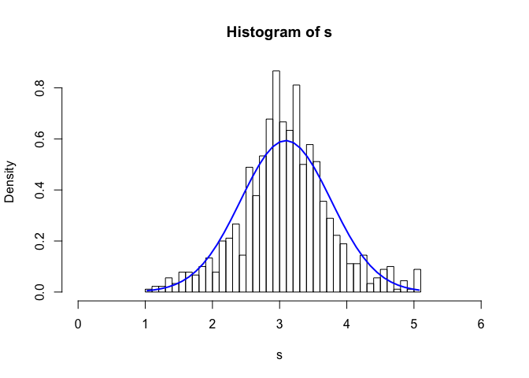

<ins>
### Problem Formulation

</ins>

The purpose of this section is to derive the estimators of OLS (Ordinary
Least Square), their expectation and variance.
*y* = *x**β* + *ϵ*

$$
\\begin{bmatrix}
y\_{1}\\\\
y\_{2}\\\\
\\vdots\\\\
y\_{T}
\\end{bmatrix}=
\\begin{bmatrix}
x\_{1,1} & x\_{1,2} & \\dots & x\_{1,K} \\\\
x\_{2,1} & x\_{2,2} & \\dots & x\_{2,K} \\\\
\\vdots & \\vdots & \\ddots & \\vdots \\\\
x\_{T,1} & x\_{T,2} & \\dots & x\_{T,K}
\\end{bmatrix}
\\begin{bmatrix}
\\beta\_{1}\\\\
\\vdots\\\\
\\beta\_{K}
\\end{bmatrix}+
\\begin{bmatrix}
\\epsilon\_{1}\\\\
\\epsilon\_{2}\\\\
\\vdots\\\\
\\epsilon\_{T}
\\end{bmatrix}
$$
 note that
*e* = *y* − *x**β̂*
 and

*ϵ* ≠ *e*

**Goal: minimize sum of squared residuals**
*m**i**n*(*e*′*e*)
$$
\\begin{aligned}
e^{\\prime} e &=  (y-x\\hat{\\beta})^{\\prime}(y-x\\hat{\\beta}) \\\\
&= y^{\\prime} y - \\hat{\\beta}^{\\prime} x^{\\prime} y - y^{\\prime} x\\hat{\\beta} + \\hat{\\beta}^{\\prime} x^{\\prime} x \\hat{\\beta} \\\\
&= y^{\\prime} y - 2\\hat{\\beta}^{\\prime} x^{\\prime} y + \\hat{\\beta}^{\\prime} x^{\\prime} x \\hat{\\beta} \\\\
\\end{aligned}
$$

given that
(*A**B*)′ = *B*′*A*′
 and transpose of a scaler is a scaler
*y*′*x**β̂* = (*y*′*x**β̂*)′ = (*x**β̂*)′*y* = *β̂*′*x*′*y*

$$ \\frac{\\partial e^{\\prime} e}{\\partial \\hat{\\beta}} = -2x^{\\prime} y+2x^{\\prime} x \\hat{\\beta} = 0 $$

 ⇒ *x*′*x**β̂* = *x*′*y*
$$ 
\\begin{aligned}
\\Rightarrow \\hat{\\beta} &= (x^{\\prime} x)^{-1}x^{\\prime} y ,\\,\\ (\\,if \\,\\, (x^{\\prime} x)^{-1} \\,\\, exists) \\\\
 &= (x^{\\prime} x)^{-1}x^{\\prime} (x\\beta + \\epsilon) \\\\
 &= \\beta+(x^{\\prime} x)^{-1}x^{\\prime}  \\epsilon 
 \\end{aligned}
 $$

<ins>
### Unbiasedness of *β̂**O**L**S*

</ins>

*E*\[*β̂*\] = *β* + *E*\[(*x*′*x*) − 1*x*′*ϵ*\]

If *E*\[*ϵ*\] = 0 and *E*\[*ϵ*|*x*\] = 0, then
*E*\[(*x*′*x*) − 1*x*′*ϵ*\] = 0 and
*E*\[*β̂*\] = *β*.  
** ⇒ *β̂* is an unbiased estimator.**

------------------------------------------------------------------------

<ins>
### Variance of the *β̂**O**L**S*

</ins>

recall the formula for variance
*V**a**r*(*A*) = *E*\[ (*A* − *E*\[*A*\]) (*A* − *E*\[*A*\])′\]
 and the OLS estimator we just derived
*β̂**O**L**S* = *β* + (*x*′*x*) − 1*x*′*ϵ*
 and if the OLS estimator is an unbiased estimator
*E*\[*β̂**O**L**S*\] = *β*
 Then
$$
\\begin{aligned}
Var(\\hat\\beta\_{OLS}) &= E\[(x^{\\prime} x)^{-1}x^{\\prime}\\epsilon \\,\\, ((x^{\\prime} x)^{-1}x^{\\prime}\\epsilon)^{\\prime}\] \\\\
&=(x^{\\prime} x)^{-1}x^{\\prime} \\,\\, E\[\\epsilon\\epsilon^{\\prime}\] \\,\\, ((x^{\\prime} x)^{-1}x^{\\prime})^{\\prime}
\\end{aligned}
$$
 if *E*\[*ϵ**ϵ*′\] = *σ*2*I**T* and
*E*\[*ϵ*|*X*\] = 0 Then
$$
\\begin{aligned}
Var(\\hat\\beta\_{OLS}) &=(x^{\\prime} x)^{-1}x^{\\prime} \\,\\, E\[\\epsilon\\epsilon^{\\prime}\] \\,\\, ((x^{\\prime} x)^{-1}x^{\\prime})^{\\prime} \\\\
&=\\sigma^2(X^{\\prime} X)^{-1}
\\end{aligned}
$$
 We don’t know the *ϵ*…we only have the estimate of it-the residuals *e*
where *e* = *Y* − *X**β̂**O**L**S*.

Then we estimate the *σ*2 by
$$s^2= \\frac{e^{\\prime} e}{T-K} $$
 where *K* is the number of explanatory variables

Therefore, our estimate of variance of *β̂**O**L**S* becomes
*s*2(*X*′*X*) − 1
 Then the distribution of *β̂**O**L**S* becomes a
t-distribution with *T* − *K* degree of freedoms with *m**e**a**n* = *β*
and
*v**a**r**i**a**n**c**e* = *s*2(*X***′*X*) − 1

<ins>
### Distribution of *β̂**O**L**S*

</ins>

With the expected value and variance estimated in the above sections, we
still need to know the sampling distribution of *β̂**O**L**S*
to perform the significant test

-   *ϵ* is normally distributed, then *β̂**O**L**S* is
    normally distributed
-   Don’t know *ϵ*’s distribution: Large sample -&gt;
    *β̂**O**L**S* is asymtotically normally distributed. The
    common argument for this assumption is that *ϵ* is a sum of many
    unobserved factors, so by Generalized Central Limit Theorem it is
    asymtotically normally distributed. (Note: the standard Central
    Limit Theorem requires that the samples of the unobserved factors
    are i.d.d. which is not the case in the real world)

The following code takes a sample of 20 non-i.d.d. variables (Normal,
Uniform or Cauchy distributions with different parameters) and simulate
1000 times.

    N <- 1000
    s <- numeric(0)
    for(i in 1:N) {
      x1 <- rnorm(1,-2,1)
      x2 <- rnorm(1,-1,1)
      x3 <- rnorm(1,2,1)
      x4 <- rnorm(1,2,0.5)
      x5 <- rnorm(1,5,2)
      x6 <- rnorm(1,7,2)
      x7 <- rcauchy(1,2,1)
      x8 <- rcauchy(1,2,2)
      x9 <- runif(1,0,3)
      x10 <- runif(1,2,3)
      x11 <- runif(1,3,5)
      x12 <- rnorm(1,2.2,0.8)
      x13 <- rnorm(1,6,1)
      x14 <- rcauchy(1,2,1.5)
      x15 <- runif(1,0,6)
      x16 <- runif(1,5,6)
      x17 <- rnorm(1,3,1)
      x18 <- rnorm(1,10,3)
      x19 <- rcauchy(1,2,2)
      x20 <- runif(1,-2,8)
      s20 <- x1+x2+x3+x4+x5+x6+x7+x8+x9+x10+x11+x12+x13+x14+x15+x16+x17+x18+x19+x20
      s20 <- s20/20
      s <- c(s, s20)
    }
    s_95q <- quantile(s,0.95)
    s_5q <- quantile(s,0.05)
    s <- s[which(s>s_5q & s<s_95q)]
    hist(s, breaks = 40, xlim=c(0,6), freq = F)
    xfit <- seq(min(s), max(s), length=40)
    s_mean <- mean(s)
    s_sd <- sd(s)
    yfit_density <- dnorm(xfit, mean=s_mean,sd=s_sd)
    lines(xfit, yfit_density, col="blue", lwd=2)

<ins>
### Significancy & Confidence Interval

</ins>

The significance test and condifence intervals tell us about the same
thing we want to know and will have the same conclusion. However, there
are suble difference of the way they look at this.

**The t statistics:**
$$t = \\frac{\\bar{X}-\\mu}{\\hat{\\sigma}/\\sqrt{n}}$$
 where *μ* is the population mean, *σ̂* is the estimate of the standard
deviation of the population. The t statistics follows **Student t
distribution**. (Derived from $\\frac{\\bar{X}-\\mu}{\\sigma/\\sqrt{n}}$
follows normal distribution by the central limit theorem, but the
standard deviation of the population is an estimation from the sample in
t statistics)

-   The significance test has the *μ* as the value of Null hypothesis
    and measures the distance of sample mean from the Null hypothesis.

-   The confidence interval is an interval with the sample mean at the
    center and the confidence limit stretched from the sample mean.

<ins>
### F Test for the Model

</ins>

*y* = *β*0 + *β*1*x*1 + *β*2*x*2 + ... + *β**p**x**p* + *ϵ*

*H*0 : *β*1 = *β*2 = ... = *β**p* = 0
*H*1 : *β**i* ≠ 0
 Sum of Squared Residuals of the Unrestricted model (the above
equation):
$$SSR\_U = \\sum\_{i=1}^n e\_U^2$$
 where *e**R* is the estimate of *ϵ* by the unrestricted
model

The restricted model (No explanatory variables)
*y* = *β*0 + *e**R*

then Sum of Squared Residuals of the Restricted model:
$$SSR\_R = \\sum\_{i=1}^n e\_R^2$$

*S**S**R**R* &gt; *S**S**R**U*

but is it signigicant?

$$F = \\frac{(SSR\_R-SSR\_U)/p}{SSR\_U/(n-p-1)}$$
 Recall the Chi-square distribution - If
*Z*1, ...*Z**k* are independent, standard normal
random variables, then the sum of their squares,

$$Q = \\sum\_{i=1}^k Z\_i^2$$

*Q* ∼ *χ*2(*k*)

where *k* specifies the degree of freedom. The F distribution is the
ratio of 2 scaled independent Chi-square distribution. The F test
requires the sample errors *e* ,or *Z**i* to be normally
distributed.
